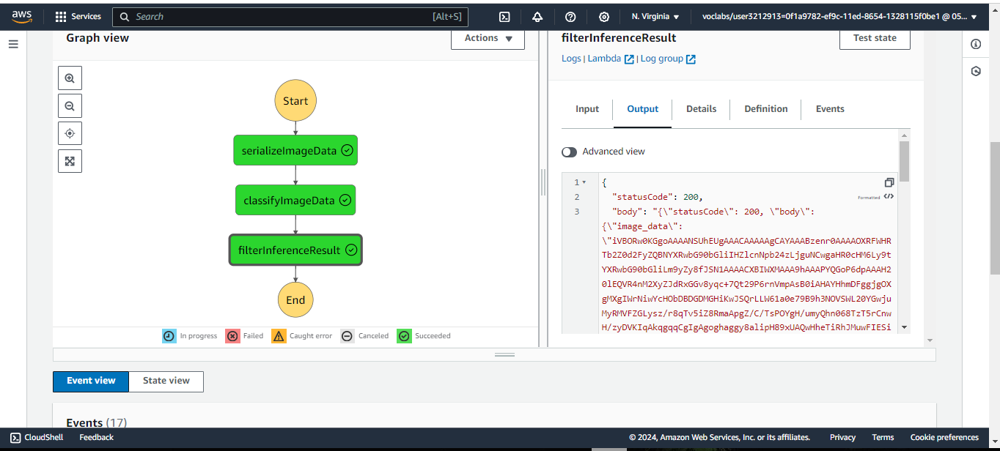

# Scones Unlimited: Image Classification Model On Amazon Sagemaker

## Project Overview

Scones Unlimited is a scone-delivery-focused logistics company aiming to optimize its delivery operations by routing delivery drivers based on their vehicle type. This project involves developing an image classification model to distinguish between bicycles and motorcycles. The model will help Scones Unlimited route drivers to the correct loading bay and orders, assigning bicycle deliveries to nearby orders and motorcycle deliveries to farther ones.

This project utilizes AWS services such as SageMaker for model training and deployment, Lambda for supporting services, and Step Functions for orchestration.

## 1. Project Steps

### Step 1: Data Staging

1. **Extract Data**: Download the CIFAR-100 dataset to simulate the challenges faced in image classification.
2. **Transform Data**: Preprocess the images by resizing, normalizing, and augmenting them.
3. **Load Data**: Load the transformed data into a production system for training.

#### Extract Data

```python
import tarfile
import requests

def extract_cifar_data(url, extract_path):
    response = requests.get(url, stream=True)
    file = tarfile.open(fileobj=response.raw, mode="r:gz")
    file.extractall(path=extract_path)

extract_cifar_data('https://www.cs.toronto.edu/~kriz/cifar-100-python.tar.gz', './data')
```

### Step 2: Model Training

1. **Choose Algorithm**: Use Convolutional Neural Networks (CNN) for image classification.
2. **Train Model**: Train the model using AWS SageMaker with the preprocessed data.
3. **Evaluate Model**: Validate the model's accuracy and performance on a test set.

### Step 3: Model Deployment

1. **Deploy Model**: Deploy the trained model on AWS SageMaker.
2. **Create Endpoint**: Set up an endpoint for real-time predictions.

### Step 4: Supporting Services with AWS Lambda

1. **SerializeImageData**: A Lambda function that serializes image data from S3.
2. **ImageClassification**: A Lambda function that invokes the model endpoint and processes predictions.
3. **FilterInferenceResult**: A Lambda function that filters low-confidence inferences.

### Step 5: Orchestration with AWS Step Functions

1. **Define Workflow**: Use AWS Step Functions to orchestrate the workflow, including image input, model invocation, and result processing.
2. **Error Handling**: Add error handling and retries for robustness.

### Step 6: Monitoring and Maintenance

1. **Monitor Performance**: Use AWS CloudWatch to monitor logs and metrics.
2. **Set Up Alerts**: Configure alerts for performance degradation or issues.
3. **Update Model**: Periodically retrain and update the model to maintain accuracy.

## 2. Approach:

The project aims to develop an image classification Machine Learning Model using workflows on Amazon SageMaker, automating various Machine Learning tasks such as Data Preparation, Model Training, Deployment, and Inference with the help of AWS Step Functions and Lambda functions.

### 2.1. Individual AWS Lambda functions drafted to build an AWS Step Functions Workflow:

1. The `serializeImageData` Lambda Function takes the address of an image hosted in S3, and returns a serialized JSON object.
2. The `Image-Classification` Lambda Function accepts the JSON object obtained from step 1 and sends it to an endpoint, collecting inferences as a JSON object.
3. The `Filter Low Confidence Inferences` Lambda Function takes the inference data from step 2, and filters only the images that meet the pre-defined threshold.

### 2.2. Building a State Machine via AWS Step Functions

#### 2.2.1. Execution Flow of the Step Function




#### 2.2.2. Step Function Graph


#### 2.2.3. Step Function Output


### Project Completion Badge


## Conclusion

This project showcases the implementation of a scalable and efficient image classification model using AWS services. By following the steps outlined, you can create a robust solution to optimize delivery operations for Scones Unlimited.
